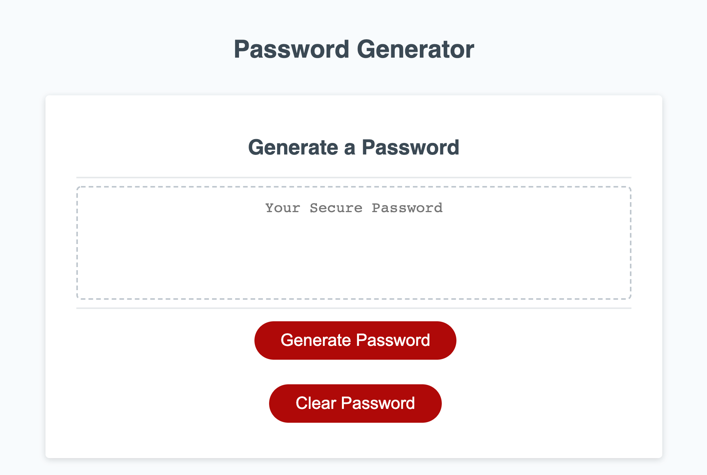

# Password Generator

# Description
This purpose of this project was to design an online random password generator that has the ability to take in user input to create a password with specific parameters. This program is capable of creating a password with a length between 8 and 128 characters. It can also include any combination of one or more of the following characteristics: lower case letters, upper case letters, numbers, and/or special characters. 

# Table of Contents
- [Built With](#built-with)
- [Code Access](#code-access)
- [Preview](#preview)
- [Functionality](#functionality)
- [Password Generator Link](#password-generator-link)
- [Credit](#credit)

# Built With
- HTML
- CSS
- JavaScript

# Code Access

If you would like to access this project's code, you will need to visit the programs (GITHUB LINK ADDED) repository. 

# Preview

Below is a screenshot of the password generator in the browser:

# Functionality
Upon requesting a password (by clicking the generate password button) the user is confronted with several window prompts. The prompts are as follows:
- How many characters do you want your password to contain? 
- Do you want your password to contain lower case characters?
- Do you want your password to contain upper case characters?
- Do you want your password to contain numbers?
- Do you want your password to contain special characters?
As long as the user chooses at least one of the password characteristics then a password of any given length within the length parameters will be created.
The final password will appear in the textbox above the generate password button.
The user then has two options the first is to clear the generated password from the text area by clicking the Clear Password button. The second option is that they can choose to click the Generate Password button to generate a new password which after answering all the prompts will just replace the old password in the text area with a new password.

# Password Generator Link

The link to the password generator program is provided below:

# Credit

The html and css were provided as started code for this project. The javascript was almost entirely written by myself, Sammi Moore, with the exception of a couple of lines of started code.

